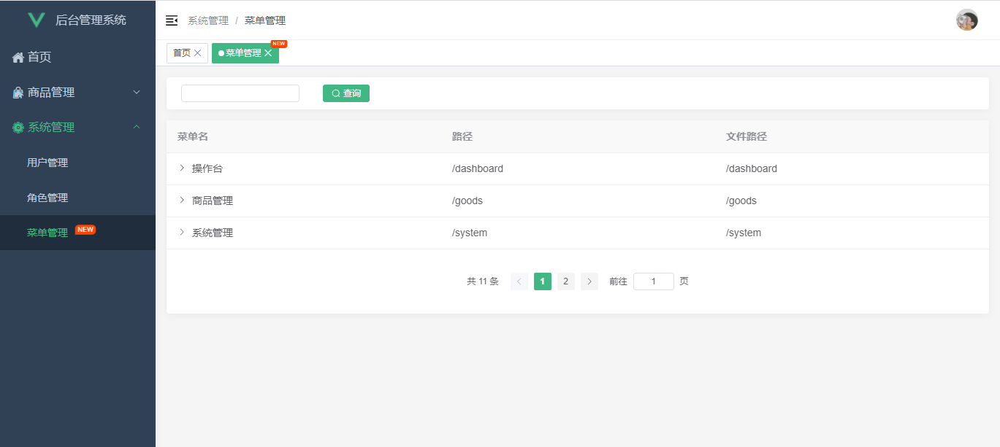

## 简介

使用vue3.x + vite + element-plus，开发的一套后台管理系统模板

## 功能

```
- 多环境发布，配置对应环境数据（src/config/index.js）
- 动态路由权限
- 标签页（keep-alive + vuex）
- 多维度axios封装
- element-plus自定义主题 + 按需引入 + 自动引入
- vue、vue-router、vuex、components文件夹组件自动引入
- scss变量
```

## 启动项目

```bash
# 安装依赖
npm install

# npm 下载速度慢的问题可以修改npm源后再 npm install
npm config set registry https://registry.npm.taobao.org

# 启动开发环境
npm run dev

# 账号
admin / 123456
```

## 打包

```bash
# 测试环境
npm run test

# 生产环境
npm run build
```


## 鸣谢
[vue-admin-template](https://github.com/PanJiaChen/vue-admin-template)